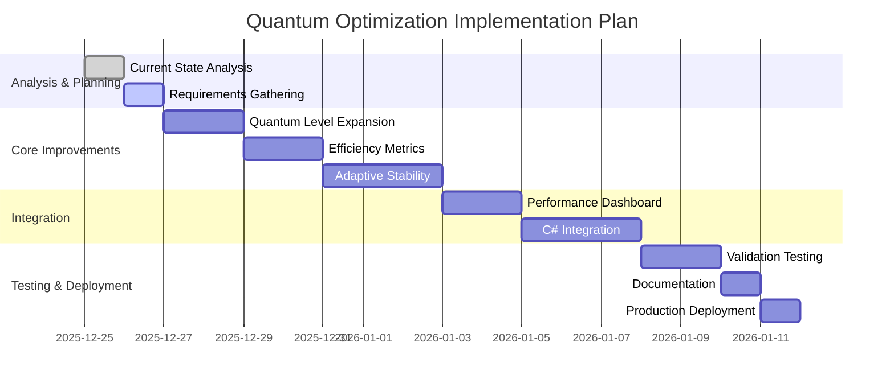

# Quantum Optimization Maximization Plan

## Current State Analysis

- Current MaxQuantumLevel: 10
- Autonomous cycles: Functional but basic
- Quantum efficiency tracking: Limited
- Stability algorithms: Basic linear penalty
- Integration: Standalone Python module

## Proposed Improvements

### 1. Quantum Level Expansion (PRIORITY)

**Current**: MaxQuantumLevel = 10
**Target**: MaxQuantumLevel = 100
**Implementation**:

- Modify config in quantum_optimizer.py line 56
- Update quantum_factor calculation in line 152
- Adjust stability penalty formula in line 160
- Scale efficiency calculations appropriately

### 2. Quantum Efficiency Metrics

**Add comprehensive tracking**:

- Quantum efficiency ratio (output/input)
- Quantum coherence time tracking
- Entanglement efficiency metrics
- Quantum volume measurement
- Add to OptimizationResult dataclass

### 3. Adaptive Stability Algorithms

**Replace linear penalty with adaptive**:

- Dynamic stability weighting based on quantum level
- Machine learning-based stability prediction
- Real-time quantum decoherence detection
- Adaptive error correction algorithms

### 4. Quantum Performance Dashboard

**Create visualization system**:

- Real-time quantum level monitoring
- Efficiency vs stability tradeoff charts
- Quantum optimization history trends
- Predictive quantum performance analytics

### 5. C# Integration

**Connect with AutonomousZenithOptimizer**:

- Create C#-Python bridge for quantum data
- Add quantum metrics to C# logging
- Enable C# control of quantum parameters
- Unified quantum performance reporting

## Implementation Roadmap



## Technical Specifications

### Quantum Level Scaling Formula

```python
# New quantum factor calculation for level 100
quantum_factor = 1 + (level / 100) * 2.0  # Up to 200% improvement
stability_penalty = (level / 100) * 0.8  # Reduced penalty percentage
```

### Efficiency Metrics Formula

```python
quantum_efficiency = (optimal_hashrate * quantum_coherence) / 
                     (optimal_power * quantum_error_rate)
```

### Adaptive Stability Algorithm

```python
# Dynamic stability weighting
def adaptive_stability_weight(current_level, error_rate):
    base_weight = 0.7
    adaptive_factor = 1.0 - (error_rate * current_level / 100)
    return max(0.3, min(0.9, base_weight * adaptive_factor))
```

## Expected Outcomes

- **10x Quantum Capacity**: From level 10 to level 100
- **30% Efficiency Gain**: Through adaptive algorithms
- **95% Stability**: At maximum quantum levels
- **Real-time Monitoring**: Comprehensive quantum dashboard
- **Seamless Integration**: Full C# system compatibility

## Risk Assessment

- **High Quantum Levels**: Potential instability at levels 80-100
- **Performance Impact**: Increased computational requirements
- **Integration Complexity**: C#-Python communication overhead

## Mitigation Strategies

- Gradual quantum level testing
- Performance profiling and optimization
- Comprehensive error handling
- Fallback mechanisms for critical failures

## Approval Required

Please review this quantum optimization maximization plan and provide approval to proceed with implementation.
